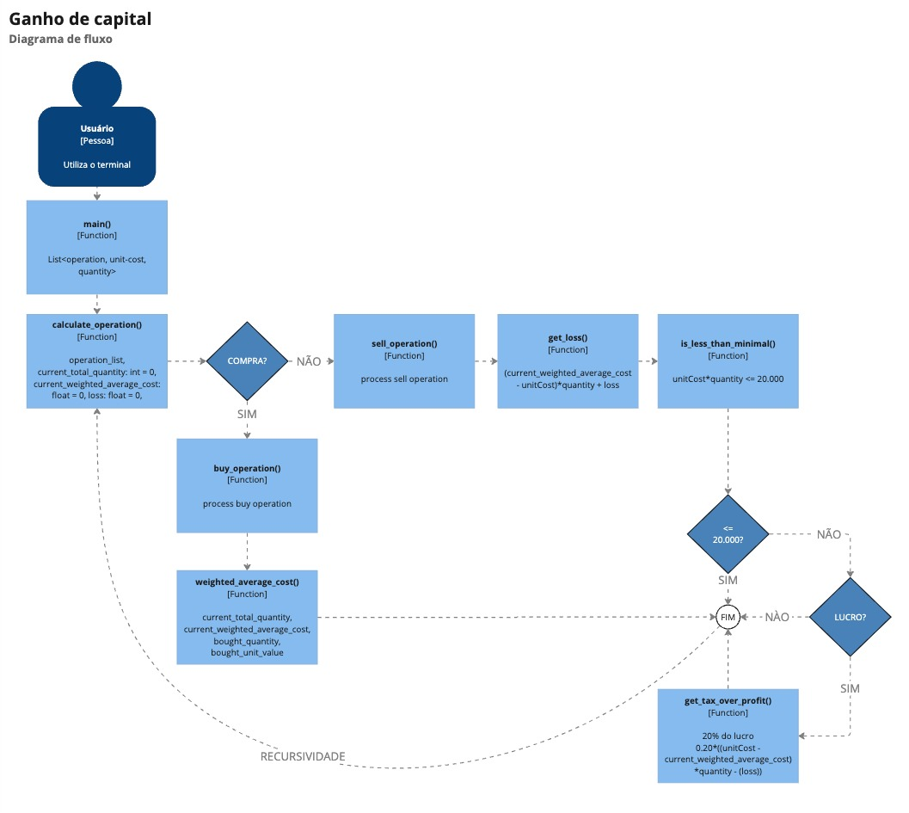

# 💼 Capital Gains

Capital gains calculation tool for calculating tax on profits from purchase and sale transactions of financial assets.

  

## 📑 Index

- [💼 Capital Gains](#-capital-gains)
  - [📑 Index](#-index)
  - [🔧 Technical Decisions](#-technical-decisions)
  - [📚 Frameworks and Libraries](#-frameworks-and-libraries)
  - [⚙️ Requirements](#️-requirements)
  - [🚀 How to Run the Project](#-how-to-run-the-project)
    - [📂 With an Input File](#-with-an-input-file)
    - [✍️ With Manual Input](#️-with-manual-input)
  - [📝 How to run the test coverage report](#-how-to-run-the-test-coverage-report)
  - [📈 Flow Diagram](#-flow-diagram)

## 🔧 Technical Decisions

**🐍 Python:** The choice of Python was made to allow for a project with less complexity in files and configurations and to facilitate the execution of the project on different operating systems.

**🧪 Pytest:** The choice of Pytest was due to its easy configuration and execution, in addition to having a simple and intuitive syntax.

**📊 Coverage:** The choice of Coverage was made to enable the analysis of the project's test coverage.

**📈 Flow Diagram:** The creation of a [flow diagram](#flow-diagram) was made to facilitate the development and visualization of the program's execution flow.

## 📚 Frameworks and Libraries

- [Pytest](https://docs.pytest.org/en/stable/): A testing framework for Python.
- [Coverage](https://coverage.readthedocs.io/en/coverage-5.5/): A test coverage analysis tool for Python.

## ⚙️ Requirements

- Python 3
- Pip

## 🚀 How to Run the Project

There are two ways to run the project:

### 📂 With an Input File

1. Run the project with an input file:

```bash
python3 src/main.py < src/resources/input.txt
```

### ✍️ With Manual Input

1. Run the project with manual input:

```bash
python3 src/main.py
```

2. Enter the data manually (example):
```bash
[{"operation":"buy", "unit-cost":10.00, "quantity": 10000},{"operation":"sell", "unit-cost":20.00, "quantity": 5000},{"operation":"sell", "unit-cost":5.00, "quantity": 5000}]
```

## 📝 How to run the test coverage report

1. Install the project dependencies:

```bash
pip3 install -r requirements.txt
```

2. Run the tests:

```bash
coverage run --source=src.main -m pytest && coverage html
```

3. Open the `htmlcov/index.html` file in a browser to view the test coverage report.

## 📈 Flow Diagram

